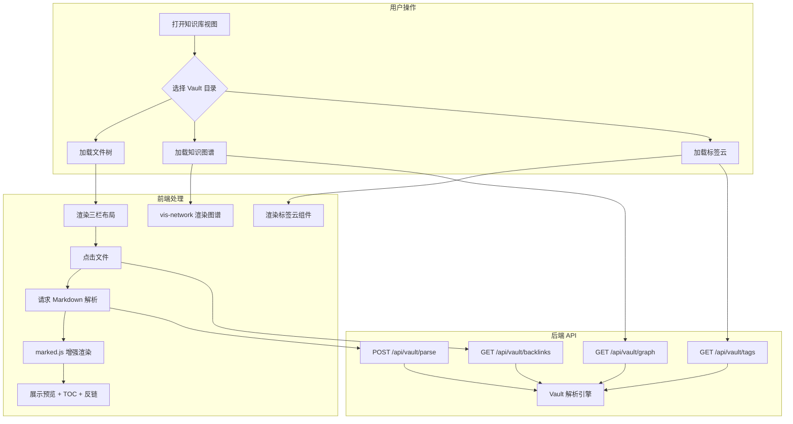

# Implementation Status

> Last updated: 2026-04-14

## Completed Features

| Module | Feature | Status | Notes |
|--------|---------|--------|-------|
| **Backend - Vault Engine** | Wiki-link extraction (`[[target]]`, `[[target\|alias]]`) | Done | `extractWikiLinks()` in server.js |
| **Backend - Vault Engine** | Tag extraction (frontmatter + inline `#tags`) | Done | `extractTags()` in server.js |
| **Backend - Vault Engine** | Frontmatter (YAML) parsing | Done | `parseFrontmatter()` in server.js |
| **Backend - Vault Engine** | Recursive vault scanning | Done | `scanVault()` in server.js |
| **Backend - Vault Engine** | Path validation and security | Done | `validateVaultPath()` with HOME_DIR + vaultPaths checks |
| **Backend - Vault Engine** | LRU cache (20 entries, 5-min TTL) | Done | `VaultCache` class in server.js |
| **Backend - API** | `GET /api/vault/graph` | Done | Returns nodes + edges from wiki-links |
| **Backend - API** | `GET /api/vault/backlinks` | Done | Returns backlinks for a target file |
| **Backend - API** | `GET /api/vault/tags` | Done | Returns tag map with associated files |
| **Backend - API** | `POST /api/vault/parse` | Done | Parses markdown, extracts metadata/links/tags/headings |
| **Frontend - UI** | Vault browser view (three-pane layout) | Done | File tree, preview, TOC + backlinks |
| **Frontend - UI** | Knowledge graph (vis-network) | Done | Interactive node graph with click-to-navigate |
| **Frontend - UI** | Backlinks panel | Done | Shows files linking to current note |
| **Frontend - UI** | Tag cloud | Done | Aggregated tags with click-to-filter |
| **Frontend - Markdown** | Wiki-link rendering | Done | Clickable links in rendered markdown |
| **Frontend - Markdown** | Callout blocks (`> [!type]`) | Done | note, info, tip, warning, danger, quote, example |
| **Frontend - Markdown** | Frontmatter display | Done | Rendered as metadata panel |
| **Frontend - Markdown** | Inline tag rendering | Done | Clickable `#tag` spans |
| **Testing** | Playwright API tests | Done | Tests for all 4 vault endpoints |
| **Testing** | Playwright UI smoke tests | Done | Page load, navigation, static assets |
| **Documentation** | API reference (actual implementation) | Done | docs/api-reference.md |

## Not Yet Implemented

| Module | Feature | Status | Notes |
|--------|---------|--------|-------|
| **Backend - API** | `GET /api/vault/config` | Planned | Return vault configuration to frontend |
| **Backend - Vault Engine** | File watcher (fs.watch) | Planned | Auto-invalidate cache on file changes |
| **Frontend - Markdown** | Embed rendering (`![[file]]`) | Planned | Async-load embedded note content |
| **Frontend - Markdown** | Mermaid diagram rendering | Planned | Code blocks with `mermaid` language |
| **Backend - API** | Advanced query params (groupBy, filter, maxNodes) | Planned | Currently uses simple scan-all approach |
| **Backend - API** | Backlink context snippets | Planned | Show surrounding text for each backlink |

---

# WebFiles Obsidian 集成方案

> 在 WebFiles 中集成 Obsidian vault 浏览和知识图谱功能  
> 版本：1.0  
> 日期：2026-04-13

---

## 一、项目概述

### 1.1 目标

在现有 WebFiles 文件管理器中集成以下能力：

1. **Obsidian Markdown 增强**：支持 Wiki-Link、Callout、Frontmatter、标签、嵌入等 Obsidian 扩展语法
2. **Vault 浏览器**：三栏式 Obsidian vault 浏览界面（文件树 | 预览 | TOC + 反链）
3. **知识图谱**：基于文件间 `[[]]` 链接关系的交互式网络图谱
4. **反向链接**：自动发现并展示所有指向当前文件的链接
5. **标签系统**：聚合 vault 内所有标签，提供标签云导航

### 1.2 核心价值

| 价值维度 | 说明 |
|---------|------|
| 零迁移成本 | 直接浏览本地 Obsidian vault，无需导入/导出 |
| Web 原生 | 任何设备通过浏览器即可访问知识库 |
| 轻量扩展 | 不引入前端框架，通过 CDN 加载少量库实现 |
| 与现有功能互补 | 文件管理 + 终端 + 知识图谱一站式 |

### 1.3 技术约束

- 后端单文件 `server.js`，新增路由以模块化函数组织
- 前端单文件 `index.html`，新增功能以 IIFE 模块组织
- 所有第三方库通过 CDN 加载，无构建工具
- 兼容现有暗色主题

---

## 二、架构设计

### 2.1 ASCII 架构图

```
┌──────────────────────────────────────────────────────────────────┐
│                        WebFiles 前端 (index.html)                │
│                                                                  │
│  ┌─────────────┐  ┌──────────────┐  ┌────────────────────────┐  │
│  │  文件管理器  │  │  终端 (xterm) │  │    知识库视图（新增）    │  │
│  │  (现有)      │  │  (现有)       │  │                        │  │
│  └──────┬──────┘  └──────┬───────┘  │  ┌──────────────────┐  │  │
│         │                │          │  │  Markdown 增强    │  │  │
│         │                │          │  │  (marked ext)     │  │  │
│         │                │          │  ├──────────────────┤  │  │
│         │                │          │  │  知识图谱         │  │  │
│         │                │          │  │  (vis-network)    │  │  │
│         │                │          │  ├──────────────────┤  │  │
│         │                │          │  │  反链 & 标签面板   │  │  │
│         │                │          │  └──────────────────┘  │  │
│         │                │          └───────────┬────────────┘  │
└─────────┼────────────────┼──────────────────────┼──────────────┘
          │                │                      │
          ▼                ▼                      ▼
┌──────────────────────────────────────────────────────────────────┐
│                     后端 (server.js)                             │
│                                                                  │
│  ┌──────────────┐  ┌───────────────┐  ┌───────────────────────┐ │
│  │  文件 API     │  │  终端 API      │  │  Vault API（新增）     │ │
│  │  (现有)       │  │  (现有)        │  │                       │ │
│  │              │  │               │  │  /api/vault/graph     │ │
│  │  /api/files  │  │  /api/terminal │  │  /api/vault/backlinks│ │
│  │  /api/upload │  │               │  │  /api/vault/tags      │ │
│  │  ...         │  │               │  │  /api/vault/parse     │ │
│  └──────────────┘  └───────────────┘  └───────────────────────┘ │
│                                                                  │
│  ┌──────────────────────────────────────────────────────────────┐│
│  │  Vault 解析引擎（新增）                                        ││
│  │  ┌──────────┐ ┌───────────┐ ┌──────────┐ ┌───────────────┐ ││
│  │  │ Wiki-Link│ │ Frontmatter│ │ 标签提取  │ │ 嵌入解析      │ ││
│  │  │ 解析器    │ │ 解析器     │ │         │ │              │ ││
│  │  └──────────┘ └───────────┘ └──────────┘ └───────────────┘ ││
│  └──────────────────────────────────────────────────────────────┘│
└──────────────────────────────────────────────────────────────────┘
```

### 2.2 Mermaid 流程图



### 2.3 新增模块与现有模块关系

```
现有模块                          新增模块
─────────────                    ─────────────
server.js                        ├── vaultRouter（路由挂载）
  ├── express.static()           │   ├── GET  /api/vault/graph
  ├── /api/files                 │   ├── GET  /api/vault/backlinks
  ├── /api/terminal              │   ├── GET  /api/vault/tags
  └── /api/upload                │   └── POST /api/vault/parse
                                  │
index.html                       ├── vaultView（视图管理）
  ├── FileManager                │   ├── graphPanel（图谱面板）
  ├── TerminalManager            │   ├── backlinksPanel（反链面板）
  ├── marked (CDN)               │   ├── tagsPanel（标签面板）
  └── CodeMirror (CDN)           │   └── vaultTree（文件树）
                                  │
                                  ├── marked 扩展
                                  │   ├── wikiLinkExtension
                                  │   ├── calloutExtension
                                  │   ├── embedExtension
                                  │   └── tagExtension
                                  │
                                  └── CDN 新增
                                      ├── vis-network
                                      ├── highlight.js
                                      └── mermaid
```

---

## 三、功能模块设计

### 模块 A - Obsidian Markdown 增强

#### A.1 Wiki-Link `[[]]` 解析与跳转

**语法**：`[[文件名]]` 或 `[[文件名|显示文本]]`

**marked.js 自定义扩展实现**：

```javascript
// wikiLinkExtension.js - marked.js 自定义扩展
const wikiLinkExtension = {
  name: 'wikiLink',
  level: 'inline',
  start(src) {
    return src.indexOf('[[');
  },
  tokenizer(src) {
    const rule = /^\[\[([^\]|]+)(?:\|([^\]]+))?\]\]/;
    const match = rule.exec(src);
    if (match) {
      return {
        type: 'wikiLink',
        raw: match[0],
        target: match[1].trim(),
        alias: match[2] ? match[2].trim() : null
      };
    }
  },
  renderer(token) {
    const display = token.alias || token.target;
    const encoded = encodeURIComponent(token.target);
    return `<a class="wiki-link" href="#vault:${encoded}" data-target="${encoded}">${display}</a>`;
  }
};

// 注册扩展
marked.use({ extensions: [wikiLinkExtension] });
```

**后端解析（用于图谱构建）**：

```javascript
// server.js 中提取 wiki-links
function extractWikiLinks(content) {
  const regex = /\[\[([^\]|]+)(?:\|[^\]]+)?\]\]/g;
  const links = [];
  let match;
  while ((match = regex.exec(content)) !== null) {
    links.push(match[1].trim());
  }
  return links;
}
```

#### A.2 Callout `> [!note]` 语法

**语法**：

```markdown
> [!note] 标题
> 内容

> [!warning] 注意
> 这是警告内容
```

**支持的类型**：`note`、`info`、`warning`、`tip`、`danger`、`quote`、`example`

**marked.js 自定义扩展**：

```javascript
const calloutExtension = {
  name: 'callout',
  level: 'block',
  start(src) {
    return src.indexOf('> [!');
  },
  tokenizer(src) {
    const rule = /^> \[!(\w+)\]\s*(.*?)\n((?:>.*\n?)*)/;
    const match = rule.exec(src);
    if (match) {
      const type = match[1].toLowerCase();
      const title = match[2].trim();
      const body = match[3]
        .split('\n')
        .map(line => line.replace(/^>\s?/, ''))
        .join('\n')
        .trim();
      return {
        type: 'callout',
        raw: match[0],
        calloutType: type,
        calloutTitle: title || getDefaultTitle(type),
        calloutBody: body
      };
    }
  },
  renderer(token) {
    const bodyHtml = marked.parseInline(token.calloutBody);
    return `<div class="callout callout-${token.calloutType}">
      <div class="callout-title">${token.calloutTitle}</div>
      <div class="callout-body">${bodyHtml}</div>
    </div>`;
  }
};

function getDefaultTitle(type) {
  const titles = {
    note: '笔记', info: '信息', tip: '提示',
    warning: '警告', danger: '危险', quote: '引用', example: '示例'
  };
  return titles[type] || type;
}
```

**CSS 样式**：

```css
.callout {
  padding: 12px 16px;
  margin: 8px 0;
  border-radius: 4px;
  border-left: 4px solid;
}
.callout-note    { border-color: #448aff; background: rgba(68,138,255,0.1); }
.callout-info    { border-color: #00bcd4; background: rgba(0,188,212,0.1); }
.callout-tip     { border-color: #00c853; background: rgba(0,200,83,0.1); }
.callout-warning { border-color: #ff9800; background: rgba(255,152,0,0.1); }
.callout-danger  { border-color: #ff1744; background: rgba(255,23,68,0.1); }
.callout-quote   { border-color: #9e9e9e; background: rgba(158,158,158,0.1); }
.callout-example { border-color: #b388ff; background: rgba(179,136,255,0.1); }
.callout-title   { font-weight: bold; margin-bottom: 4px; }
.callout-body    { font-size: 0.95em; }
```

#### A.3 Frontmatter (YAML) 解析

**语法**：

```yaml
---
title: 笔记标题
tags: [web, javascript, 工具]
date: 2026-04-13
aliases: [别名1, 别名2]
---
```

**解析实现**：

```javascript
// 前端解析 Frontmatter
function parseFrontmatter(content) {
  const match = content.match(/^---\r?\n([\s\S]*?)\r?\n---/);
  if (!match) return { metadata: null, body: content };

  const yamlStr = match[1];
  const body = content.slice(match[0].length).trimLeft();

  // 简易 YAML 解析（无需引入库）
  const metadata = {};
  yamlStr.split('\n').forEach(line => {
    const kv = line.match(/^(\w+):\s*(.*)$/);
    if (kv) {
      const key = kv[1].trim();
      const val = kv[2].trim();
      // 处理数组 [a, b, c]
      if (val.startsWith('[') && val.endsWith(']')) {
        metadata[key] = val.slice(1, -1).split(',').map(s => s.trim());
      } else {
        metadata[key] = val;
      }
    }
  });

  return { metadata, body };
}
```

#### A.4 `#tag` 标签

**语法**：行内 `#标签` 或 `#嵌套/标签`

**marked.js 自定义扩展**：

```javascript
const tagExtension = {
  name: 'tag',
  level: 'inline',
  start(src) {
    const idx = src.indexOf('#');
    // 排除标题 # 和颜色码 #
    if (idx === -1) return -1;
    return idx;
  },
  tokenizer(src) {
    // 匹配 #tag 或 #nested/tag，排除 Markdown 标题
    const rule = /(?:^|[\s(])(#([\w\u4e00-\u9fa5][\w\u4e00-\u9fa5/]*))/;
    const match = rule.exec(src);
    if (match) {
      // 确保不是标题（前面不是行首）
      const beforeChar = src[match.index];
      if (match.index === 0 && src.startsWith('# ')) return;
      return {
        type: 'tag',
        raw: match[1],
        tagName: match[2]
      };
    }
  },
  renderer(token) {
    return `<span class="tag" data-tag="${token.tagName}" onclick="filterByTag('${token.tagName}')">#${token.tagName}</span>`;
  }
};
```

**后端标签提取**：

```javascript
function extractTags(content) {
  // 移除 frontmatter 后提取行内标签
  const body = content.replace(/^---[\s\S]*?---\n?/, '');
  const regex = /(?:^|[\s(])#([\w\u4e00-\u9fa5][\w\u4e00-\u9fa5/]*)/g;
  const tags = new Set();
  let match;
  while ((match = regex.exec(body)) !== null) {
    // 排除标题语法
    if (match.index === 0 && body.startsWith('# ')) continue;
    tags.add(match[1]);
  }
  // 同时提取 frontmatter 中的 tags
  const fmMatch = content.match(/^---[\s\S]*?tags:\s*\[([^\]]+)\]/);
  if (fmMatch) {
    fmMatch[1].split(',').forEach(t => tags.add(t.trim()));
  }
  return [...tags];
}
```

#### A.5 嵌入 `![[file]]`

**语法**：`![[文件名]]` 或 `![[文件名#标题]]` 或 `![[图片.png]]`

```javascript
const embedExtension = {
  name: 'embed',
  level: 'inline',
  start(src) {
    return src.indexOf('![[');
  },
  tokenizer(src) {
    const rule = /^!\[\[([^\]#]+)(?:#([^\]]+))?\]\]/;
    const match = rule.exec(src);
    if (match) {
      return {
        type: 'embed',
        raw: match[0],
        file: match[1].trim(),
        heading: match[2] ? match[2].trim() : null
      };
    }
  },
  renderer(token) {
    const ext = token.file.split('.').pop().toLowerCase();
    // 图片类型
    if (['png', 'jpg', 'jpeg', 'gif', 'svg', 'webp'].includes(ext)) {
      return ``;
    }
    // Markdown 嵌入（异步加载）
    return `<div class="embed-content" data-file="${encodeURIComponent(token.file)}" data-heading="${token.heading || ''}">
      <div class="embed-loading">加载 ${token.file}...</div>
    </div>`;
  }
};
```

**嵌入内容异步加载**：

```javascript
async function loadEmbeds(container) {
  const embeds = container.querySelectorAll('.embed-content');
  for (const el of embeds) {
    const file = decodeURIComponent(el.dataset.file);
    const heading = el.dataset.heading;
    try {
      const resp = await fetch('/api/vault/parse', {
        method: 'POST',
        headers: { 'Content-Type': 'application/json' },
        body: JSON.stringify({ file, vault: currentVault })
      });
      const data = await resp.json();
      let html = data.html;
      if (heading) {
        // 提取指定标题下的内容
        html = extractHeading(html, heading);
      }
      el.innerHTML = `<div class="embed-header">${file}</div>${html}`;
    } catch (e) {
      el.innerHTML = `<div class="embed-error">加载失败: ${file}</div>`;
    }
  }
}
```

#### A.6 代码高亮 (highlight.js)

**CDN 引入**：

```html
<!-- highlight.js -->
<link rel="stylesheet" href="https://cdn.jsdelivr.net/gh/highlightjs/cdn-release@11/build/styles/atom-one-dark.min.css">
<script src="https://cdn.jsdelivr.net/gh/highlightjs/cdn-release@11/build/highlight.min.js"></script>
```

**marked.js 集成**：

```javascript
// 自定义代码渲染器
const renderer = {
  code(code, language) {
    const lang = language || '';
    let highlighted;
    if (lang && hljs.getLanguage(lang)) {
      highlighted = hljs.highlight(code, { language: lang }).value;
    } else {
      highlighted = hljs.highlightAuto(code).value;
    }
    return `<pre><code class="hljs language-${lang}">${highlighted}</code></pre>`;
  }
};
marked.use({ renderer });
```

#### A.7 Mermaid 图表渲染

**CDN 引入**：

```html
<script src="https://cdn.jsdelivr.net/npm/mermaid@11/dist/mermaid.min.js"></script>
```

**初始化与渲染**：

```javascript
// 初始化 mermaid（暗色主题）
mermaid.initialize({
  startOnLoad: false,
  theme: 'dark',
  themeVariables: {
    darkMode: true,
    background: '#1e1e2e',
    primaryColor: '#89b4fa'
  }
});

// 自定义 mermaid 代码块处理
const mermaidExtension = {
  name: 'mermaidBlock',
  level: 'block',
  start(src) {
    const idx = src.indexOf('```mermaid');
    return idx !== -1 ? idx : -1;
  },
  tokenizer(src) {
    const rule = /^```mermaid\n([\s\S]*?)```/;
    const match = rule.exec(src);
    if (match) {
      return {
        type: 'mermaidBlock',
        raw: match[0],
        code: match[1].trim()
      };
    }
  },
  renderer(token) {
    const id = 'mermaid-' + Math.random().toString(36).slice(2, 9);
    return `<div class="mermaid-container" id="${id}" data-code="${encodeURIComponent(token.code)}">
      <div class="mermaid-loading">渲染图表中...</div>
    </div>`;
  }
};

// 异步渲染所有 mermaid 图表
async function renderMermaidDiagrams(container) {
  const els = container.querySelectorAll('.mermaid-container');
  for (const el of els) {
    const code = decodeURIComponent(el.dataset.code);
    try {
      const { svg } = await mermaid.render(el.id + '-svg', code);
      el.innerHTML = svg;
    } catch (e) {
      el.innerHTML = `<div class="mermaid-error">图表渲染失败: ${e.message}</div>`;
    }
  }
}
```

---

### 模块 B - 知识图谱

#### B.1 vis-network 初始化

**CDN 引入**：

```html
<script src="https://cdn.jsdelivr.net/npm/vis-network@9/standalone/umd/vis-network.min.js"></script>
```

**图谱初始化**：

```javascript
function initGraph(container, data) {
  const nodes = new vis.DataSet(data.nodes);
  const edges = new vis.DataSet(data.edges);

  const options = {
    nodes: {
      shape: 'dot',
      size: 16,
      font: {
        size: 12,
        color: '#cdd6f4'
      },
      borderWidth: 2,
      borderWidthSelected: 3
    },
    edges: {
      color: {
        color: '#585b70',
        highlight: '#89b4fa',
        hover: '#89b4fa'
      },
      arrows: {
        to: { enabled: false }
      },
      smooth: {
        type: 'continuous'
      }
    },
    physics: {
      solver: 'forceAtlas2Based',
      forceAtlas2Based: {
        gravitationalConstant: -80,
        centralGravity: 0.01,
        springLength: 150,
        springConstant: 0.08
      },
      stabilization: {
        iterations: 200
      }
    },
    interaction: {
      hover: true,
      tooltipDelay: 200,
      navigationButtons: true,
      keyboard: true
    }
  };

  const network = new vis.Network(container, { nodes, edges }, options);

  // 点击节点跳转
  network.on('click', function (params) {
    if (params.nodes.length === 1) {
      const nodeId = params.nodes[0];
      const node = nodes.get(nodeId);
      if (node && node.path) {
        openVaultFile(node.path);
      }
    }
  });

  return network;
}
```

#### B.2 节点着色方案

```javascript
// 按目录分组着色
const DIR_COLORS = {
  'daily-notes': '#f38ba8',
  'projects':    '#a6e3a1',
  'areas':       '#89b4fa',
  'resources':   '#f9e2af',
  'archive':     '#6c7086',
  'templates':   '#cba6f7'
};
const DEFAULT_COLOR = '#89b4fa';

// 按标签分组着色
const TAG_COLORS = [
  '#f38ba8', '#a6e3a1', '#89b4fa', '#f9e2af',
  '#fab387', '#94e2d5', '#cba6f7', '#f5c2e7'
];

function getNodeColor(filePath, groupBy, tags) {
  if (groupBy === 'directory') {
    const dir = filePath.split('/').slice(0, -1).join('/') || 'root';
    return DIR_COLORS[dir] || DEFAULT_COLOR;
  } else if (groupBy === 'tag') {
    const primaryTag = tags[0] || 'untagged';
    const idx = Math.abs(hashCode(primaryTag)) % TAG_COLORS.length;
    return TAG_COLORS[idx];
  }
  return DEFAULT_COLOR;
}

function hashCode(str) {
  let hash = 0;
  for (let i = 0; i < str.length; i++) {
    hash = ((hash << 5) - hash) + str.charCodeAt(i);
    hash |= 0;
  }
  return hash;
}
```

#### B.3 后端图谱数据构建

```javascript
// server.js - 图谱数据构建
async function buildGraphData(vaultPath) {
  const nodes = [];
  const edges = [];
  const fileMap = new Map(); // name -> fullPath

  // 递归扫描 vault 目录
  async function scanDir(dir) {
    const entries = await fs.readdir(dir, { withFileTypes: true });
    for (const entry of entries) {
      // 跳过 .obsidian 目录
      if (entry.name.startsWith('.') || entry.name === '.obsidian') continue;
      const fullPath = path.join(dir, entry.name);
      if (entry.isDirectory()) {
        await scanDir(fullPath);
      } else if (entry.name.endsWith('.md')) {
        const relPath = path.relative(vaultPath, fullPath);
        const nameWithoutExt = entry.name.replace(/\.md$/, '');
        fileMap.set(nameWithoutExt.toLowerCase(), relPath);
        const content = await fs.readFile(fullPath, 'utf-8');
        const tags = extractTags(content);
        const frontmatter = parseFrontmatter(content);
        nodes.push({
          id: relPath,
          label: nameWithoutExt,
          path: relPath,
          tags: tags,
          title: frontmatter.metadata?.title || nameWithoutExt,
          color: getNodeColor(relPath, 'directory', tags),
          size: 16
        });
      }
    }
  }

  await scanDir(vaultPath);

  // 构建边（基于 wiki-links）
  for (const node of nodes) {
    const content = await fs.readFile(path.join(vaultPath, node.path), 'utf-8');
    const links = extractWikiLinks(content);
    for (const link of links) {
      const targetPath = fileMap.get(link.toLowerCase());
      if (targetPath) {
        edges.push({ from: node.path, to: targetPath });
      }
    }
  }

  // 计算节点大小（连接数越多越大）
  const connectionCount = new Map();
  for (const edge of edges) {
    connectionCount.set(edge.from, (connectionCount.get(edge.from) || 0) + 1);
    connectionCount.set(edge.to, (connectionCount.get(edge.to) || 0) + 1);
  }
  for (const node of nodes) {
    node.size = 10 + Math.min((connectionCount.get(node.id) || 0) * 2, 30);
  }

  return { nodes, edges };
}
```

---

### 模块 C - 反向链接

#### C.1 后端反链 API

```javascript
// server.js - 反向链接查询
async function getBacklinks(vaultPath, targetFile) {
  const backlinks = [];
  const targetName = path.basename(targetFile, '.md').toLowerCase();

  async function scanForBacklinks(dir) {
    const entries = await fs.readdir(dir, { withFileTypes: true });
    for (const entry of entries) {
      if (entry.name.startsWith('.') || entry.name === '.obsidian') continue;
      const fullPath = path.join(dir, entry.name);
      if (entry.isDirectory()) {
        await scanForBacklinks(fullPath);
      } else if (entry.name.endsWith('.md')) {
        const relPath = path.relative(vaultPath, fullPath);
        if (relPath === targetFile) continue; // 跳过自身
        const content = await fs.readFile(fullPath, 'utf-8');
        const links = extractWikiLinks(content);
        // 检查是否链接到目标文件
        const isBacklink = links.some(link => {
          const linkName = link.toLowerCase().replace(/\.md$/, '');
          return linkName === targetName ||
                 linkName === targetFile.replace(/\.md$/, '').toLowerCase();
        });
        if (isBacklink) {
          // 提取链接所在行的上下文
          const contexts = extractLinkContexts(content, targetName);
          backlinks.push({
            file: relPath,
            title: path.basename(relPath, '.md'),
            contexts: contexts
          });
        }
      }
    }
  }

  await scanForBacklinks(vaultPath);
  return backlinks;
}

// 提取链接所在行的上下文（前后各一行）
function extractLinkContexts(content, targetName) {
  const lines = content.split('\n');
  const contexts = [];
  for (let i = 0; i < lines.length; i++) {
    if (lines[i].includes(`[[${targetName}]]`) ||
        lines[i].toLowerCase().includes(`[[${targetName}]]`)) {
      const start = Math.max(0, i - 1);
      const end = Math.min(lines.length - 1, i + 1);
      contexts.push({
        line: i + 1,
        snippet: lines.slice(start, end + 1).join('\n')
      });
    }
  }
  return contexts;
}
```

#### C.2 前端反链面板

```javascript
function renderBacklinksPanel(container, backlinks) {
  if (!backlinks || backlinks.length === 0) {
    container.innerHTML = '<div class="panel-empty">暂无反向链接</div>';
    return;
  }

  container.innerHTML = `
    <div class="panel-header">
      <span class="panel-icon">↩</span>
      <span>反向链接 (${backlinks.length})</span>
    </div>
    <div class="backlinks-list">
      ${backlinks.map(bl => `
        <div class="backlink-item" data-file="${encodeURIComponent(bl.file)}">
          <div class="backlink-title" onclick="openVaultFile('${bl.file}')">
            📄 ${bl.title}
          </div>
          ${bl.contexts.map(ctx => `
            <div class="backlink-context" onclick="openVaultFile('${bl.file}', ${ctx.line})">
              <pre>${escapeHtml(ctx.snippet)}</pre>
              <span class="context-line">第 ${ctx.line} 行</span>
            </div>
          `).join('')}
        </div>
      `).join('')}
    </div>
  `;
}
```

---

### 模块 D - 标签系统

#### D.1 标签云渲染

```javascript
function renderTagCloud(container, tagsData) {
  const tags = tagsData.tags;
  if (!tags || tags.length === 0) {
    container.innerHTML = '<div class="panel-empty">暂无标签</div>';
    return;
  }

  // 计算标签大小（按出现频率）
  const maxCount = Math.max(...tags.map(t => t.count));
  const minCount = Math.min(...tags.map(t => t.count));

  container.innerHTML = `
    <div class="panel-header">
      <span class="panel-icon">🏷️</span>
      <span>标签 (${tags.length})</span>
    </div>
    <div class="tag-cloud">
      ${tags.map(tag => {
        const ratio = maxCount === minCount ? 0.5 :
          (tag.count - minCount) / (maxCount - minCount);
        const fontSize = 0.75 + ratio * 1.25; // 0.75rem ~ 2rem
        return `<span class="tag-cloud-item"
          style="font-size: ${fontSize}rem; --tag-color: ${getTagColor(tag.name)}"
          data-tag="${tag.name}"
          onclick="filterByTag('${tag.name}')">
          #${tag.name} <small>(${tag.count})</small>
        </span>`;
      }).join('')}
    </div>
    <div class="tag-files" id="tag-files"></div>
  `;
}

// 点击标签筛选文件
function filterByTag(tagName) {
  fetch(`/api/vault/tags?vault=${encodeURIComponent(currentVault)}&tag=${encodeURIComponent(tagName)}&includeFiles=true`)
    .then(r => r.json())
    .then(data => {
      const container = document.getElementById('tag-files');
      if (!data.files || data.files.length === 0) {
        container.innerHTML = '<p>无相关文件</p>';
        return;
      }
      container.innerHTML = `
        <h4>#${tagName} (${data.files.length} 个文件)</h4>
        <ul class="tag-file-list">
          ${data.files.map(f => `
            <li onclick="openVaultFile('${f.path}')">${f.title}</li>
          `).join('')}
        </ul>
      `;
    });
}
```

---

### 模块 E - Vault 视图

#### E.1 三栏布局

```html
<!-- Vault 视图 HTML 结构 -->
<div id="vault-view" class="vault-view" style="display:none;">
  <!-- 工具栏 -->
  <div class="vault-toolbar">
    <button onclick="openVaultSelector()">📂 选择 Vault</button>
    <span id="vault-name" class="vault-name"></span>
    <div class="vault-toolbar-actions">
      <button onclick="showGraph()" title="知识图谱">🌐</button>
      <button onclick="showTagCloud()" title="标签云">🏷️</button>
      <button onclick="toggleVaultFullWidth()" title="全屏">⛶</button>
    </div>
  </div>

  <!-- 三栏主体 -->
  <div class="vault-layout">
    <!-- 左栏：文件树 -->
    <div class="vault-sidebar" id="vault-sidebar">
      <div class="vault-search">
        <input type="text" placeholder="搜索文件..." oninput="searchVault(this.value)">
      </div>
      <div class="vault-tree" id="vault-tree"></div>
    </div>

    <!-- 中栏：预览 -->
    <div class="vault-preview" id="vault-preview">
      <div class="vault-empty-state">
        <p>📑 选择文件开始浏览</p>
      </div>
    </div>

    <!-- 右栏：TOC + 反链 -->
    <div class="vault-info-panel" id="vault-info-panel">
      <div class="panel-tabs">
        <button class="panel-tab active" onclick="switchInfoTab('toc')">大纲</button>
        <button class="panel-tab" onclick="switchInfoTab('backlinks')">反链</button>
        <button class="panel-tab" onclick="switchInfoTab('meta')">元数据</button>
      </div>
      <div class="panel-content" id="panel-toc"></div>
      <div class="panel-content" id="panel-backlinks" style="display:none;"></div>
      <div class="panel-content" id="panel-meta" style="display:none;"></div>
    </div>
  </div>
</div>

<!-- 全屏图谱弹出层 -->
<div id="graph-modal" class="graph-modal" style="display:none;">
  <div class="graph-modal-header">
    <h3>知识图谱</h3>
    <div class="graph-controls">
      <select id="graph-group-by" onchange="updateGraphGrouping(this.value)">
        <option value="directory">按目录分组</option>
        <option value="tag">按标签分组</option>
      </select>
      <input type="text" id="graph-search" placeholder="搜索节点..." oninput="filterGraphNodes(this.value)">
      <button onclick="closeGraphModal()">✕</button>
    </div>
  </div>
  <div class="graph-modal-body" id="graph-container"></div>
</div>
```

#### E.2 布局 CSS

```css
/* Vault 三栏布局 */
.vault-layout {
  display: flex;
  height: calc(100vh - 48px); /* 减去工具栏高度 */
}

.vault-sidebar {
  width: 260px;
  min-width: 200px;
  border-right: 1px solid var(--border-color, #313244);
  display: flex;
  flex-direction: column;
  background: var(--bg-secondary, #181825);
}

.vault-preview {
  flex: 1;
  overflow-y: auto;
  padding: 20px;
  background: var(--bg-primary, #1e1e2e);
}

.vault-info-panel {
  width: 300px;
  min-width: 240px;
  border-left: 1px solid var(--border-color, #313244);
  background: var(--bg-secondary, #181825);
  overflow-y: auto;
}

/* 全屏图谱 */
.graph-modal {
  position: fixed;
  top: 0; left: 0; right: 0; bottom: 0;
  z-index: 1000;
  background: rgba(0, 0, 0, 0.85);
  display: flex;
  flex-direction: column;
}
.graph-modal-body {
  flex: 1;
}
```

#### E.3 TOC 生成

```javascript
function generateTOC(htmlContent) {
  const tempDiv = document.createElement('div');
  tempDiv.innerHTML = htmlContent;
  const headings = tempDiv.querySelectorAll('h1, h2, h3, h4, h5, h6');

  return Array.from(headings).map(h => ({
    level: parseInt(h.tagName[1]),
    text: h.textContent,
    id: h.id || slugify(h.textContent)
  }));
}

function renderTOC(container, tocItems) {
  if (!tocItems || tocItems.length === 0) {
    container.innerHTML = '<div class="panel-empty">无标题</div>';
    return;
  }

  const minLevel = Math.min(...tocItems.map(t => t.level));
  container.innerHTML = `
    <div class="panel-header">
      <span class="panel-icon">📋</span>
      <span>大纲 (${tocItems.length})</span>
    </div>
    <div class="toc-list">
      ${tocItems.map(item => `
        <div class="toc-item toc-level-${item.level - minLevel + 1}"
             onclick="scrollToHeading('${item.id}')">
          ${item.text}
        </div>
      `).join('')}
    </div>
  `;
}

function slugify(text) {
  return text.toLowerCase()
    .replace(/[^\w\u4e00-\u9fa5]+/g, '-')
    .replace(/^-|-$/g, '');
}
```

---

## 四、API 设计

### 4.1 GET /api/vault/graph

**功能**：获取 Vault 知识图谱数据（节点和边）

**查询参数**：

| 参数 | 类型 | 必填 | 说明 |
|------|------|------|------|
| `vault` | string | 是 | Vault 目录的绝对路径或相对路径 |
| `groupBy` | string | 否 | 分组方式：`directory`（默认）或 `tag` |
| `filter` | string | 否 | 按标签或目录过滤节点 |

**返回 JSON 格式**：

```json
{
  "ok": true,
  "data": {
    "nodes": [
      {
        "id": "daily-notes/2026-04-13.md",
        "label": "2026-04-13",
        "path": "daily-notes/2026-04-13.md",
        "tags": ["日志", "项目"],
        "color": "#f38ba8",
        "size": 18
      }
    ],
    "edges": [
      {
        "from": "daily-notes/2026-04-13.md",
        "to": "projects/webfiles.md"
      }
    ],
    "stats": {
      "totalNodes": 42,
      "totalEdges": 67,
      "orphanNodes": 5
    }
  }
}
```

**错误码**：

| 状态码 | 错误码 | 说明 |
|--------|--------|------|
| 400 | `MISSING_VAULT` | vault 参数缺失 |
| 404 | `VAULT_NOT_FOUND` | Vault 目录不存在 |
| 403 | `ACCESS_DENIED` | 路径不在允许范围内 |
| 500 | `SCAN_ERROR` | 扫描过程出错 |

### 4.2 GET /api/vault/backlinks

**功能**：查询指定文件的反向链接

**查询参数**：

| 参数 | 类型 | 必填 | 说明 |
|------|------|------|------|
| `vault` | string | 是 | Vault 目录路径 |
| `file` | string | 是 | 目标文件的相对路径 |

**返回 JSON 格式**：

```json
{
  "ok": true,
  "data": {
    "file": "projects/webfiles.md",
    "backlinks": [
      {
        "file": "daily-notes/2026-04-13.md",
        "title": "2026-04-13",
        "contexts": [
          {
            "line": 15,
            "snippet": "今天在开发 [[webfiles]] 项目\n使用了 [[webfiles|WebFiles]] 作为知识管理工具\n进度顺利"
          }
        ]
      }
    ],
    "total": 3
  }
}
```

**错误码**：

| 状态码 | 错误码 | 说明 |
|--------|--------|------|
| 400 | `MISSING_VAULT` | vault 参数缺失 |
| 400 | `MISSING_FILE` | file 参数缺失 |
| 404 | `FILE_NOT_FOUND` | 目标文件不存在 |
| 403 | `ACCESS_DENIED` | 路径不在允许范围内 |

### 4.3 GET /api/vault/tags

**功能**：获取 Vault 内所有标签及统计

**查询参数**：

| 参数 | 类型 | 必填 | 说明 |
|------|------|------|------|
| `vault` | string | 是 | Vault 目录路径 |
| `tag` | string | 否 | 筛选指定标签 |
| `includeFiles` | boolean | 否 | 是否包含标签关联的文件列表（默认 false） |

**返回 JSON 格式**（不含 includeFiles）：

```json
{
  "ok": true,
  "data": {
    "tags": [
      { "name": "项目", "count": 12 },
      { "name": "日志", "count": 8 },
      { "name": "web", "count": 6 },
      { "name": "工具", "count": 5 }
    ],
    "totalTags": 15,
    "totalFiles": 42
  }
}
```

**返回 JSON 格式**（includeFiles=true）：

```json
{
  "ok": true,
  "data": {
    "tags": [
      { "name": "项目", "count": 12 }
    ],
    "files": [
      { "path": "projects/webfiles.md", "title": "WebFiles" },
      { "path": "projects/obsidian.md", "title": "Obsidian" }
    ],
    "totalTags": 15,
    "totalFiles": 42
  }
}
```

**错误码**：

| 状态码 | 错误码 | 说明 |
|--------|--------|------|
| 400 | `MISSING_VAULT` | vault 参数缺失 |
| 404 | `VAULT_NOT_FOUND` | Vault 目录不存在 |
| 403 | `ACCESS_DENIED` | 路径不在允许范围内 |

### 4.4 POST /api/vault/parse

**功能**：解析 Markdown 文件，返回增强渲染后的 HTML

**请求体**：

```json
{
  "vault": "/path/to/vault",
  "file": "projects/webfiles.md",
  "render": true
}
```

| 字段 | 类型 | 必填 | 说明 |
|------|------|------|------|
| `vault` | string | 是 | Vault 目录路径 |
| `file` | string | 是 | 文件相对路径 |
| `render` | boolean | 否 | 是否渲染 HTML（默认 true） |

**返回 JSON 格式**：

```json
{
  "ok": true,
  "data": {
    "file": "projects/webfiles.md",
    "metadata": {
      "title": "WebFiles 项目",
      "tags": ["项目", "web"],
      "date": "2026-04-13"
    },
    "html": "<h1>WebFiles 项目</h1><p>这是内容...</p>",
    "toc": [
      { "level": 1, "text": "WebFiles 项目", "id": "webfiles-项目" },
      { "level": 2, "text": "概述", "id": "概述" }
    ],
    "links": ["daily-notes/2026-04-13"],
    "tags": ["项目", "web"],
    "wordCount": 256
  }
}
```

**错误码**：

| 状态码 | 错误码 | 说明 |
|--------|--------|------|
| 400 | `MISSING_VAULT` | vault 参数缺失 |
| 400 | `MISSING_FILE` | file 参数缺失 |
| 404 | `FILE_NOT_FOUND` | 文件不存在 |
| 403 | `ACCESS_DENIED` | 路径不在允许范围内 |
| 500 | `PARSE_ERROR` | 解析过程出错 |

---

## 五、前端实现方案

### 5.1 技术选型

| 能力 | 方案 | CDN |
|------|------|-----|
| 知识图谱 | vis-network 9 | `https://cdn.jsdelivr.net/npm/vis-network@9/standalone/umd/vis-network.min.js` |
| 代码高亮 | highlight.js 11 | CSS + JS，`https://cdn.jsdelivr.net/gh/highlightjs/cdn-release@11/` |
| 图表渲染 | mermaid 11 | `https://cdn.jsdelivr.net/npm/mermaid@11/dist/mermaid.min.js` |
| Markdown | marked.js 12（已有） | 已集成 |

### 5.2 CDN 引入顺序

在 `index.html` 的 `<head>` 或 `<body>` 尾部添加：

```html
<!-- 代码高亮样式 -->
<link rel="stylesheet" href="https://cdn.jsdelivr.net/gh/highlightjs/cdn-release@11/build/styles/atom-one-dark.min.css">

<!-- highlight.js -->
<script src="https://cdn.jsdelivr.net/gh/highlightjs/cdn-release@11/build/highlight.min.js"></script>

<!-- mermaid -->
<script src="https://cdn.jsdelivr.net/npm/mermaid@11/dist/mermaid.min.js"></script>

<!-- vis-network -->
<script src="https://cdn.jsdelivr.net/npm/vis-network@9/standalone/umd/vis-network.min.js"></script>
```

### 5.3 导航栏入口

在现有导航栏添加「知识库」按钮：

```html
<!-- 导航栏新增按钮 -->
<li class="nav-item">
  <a href="#" onclick="showVaultView(); return false;" class="nav-link" id="nav-vault">
    <span class="nav-icon">📚</span>
    <span class="nav-text">知识库</span>
  </a>
</li>
```

### 5.4 暗色主题适配

所有新增组件使用 CSS 变量，与现有暗色主题保持一致：

```css
:root {
  /* 与现有主题一致的变量 */
  --bg-primary: #1e1e2e;
  --bg-secondary: #181825;
  --bg-tertiary: #11111b;
  --text-primary: #cdd6f4;
  --text-secondary: #a6adc8;
  --text-muted: #6c7086;
  --border-color: #313244;
  --accent: #89b4fa;
  --accent-hover: #74c7ec;
}

/* Wiki-Link 样式 */
.wiki-link {
  color: var(--accent);
  text-decoration: none;
  border-bottom: 1px dashed var(--accent);
  cursor: pointer;
}
.wiki-link:hover {
  color: var(--accent-hover);
  border-bottom-style: solid;
}
.wiki-link.broken {
  color: #f38ba8;
  border-bottom-color: #f38ba8;
  opacity: 0.7;
}

/* 标签样式 */
.tag {
  display: inline-block;
  background: rgba(137, 180, 250, 0.15);
  color: var(--accent);
  padding: 2px 8px;
  border-radius: 12px;
  font-size: 0.85em;
  cursor: pointer;
}
.tag:hover {
  background: rgba(137, 180, 250, 0.25);
}

/* 面板通用样式 */
.panel-header {
  padding: 10px 12px;
  font-weight: 600;
  border-bottom: 1px solid var(--border-color);
  color: var(--text-primary);
  display: flex;
  align-items: center;
  gap: 6px;
}
.panel-empty {
  padding: 20px;
  text-align: center;
  color: var(--text-muted);
}
.panel-tabs {
  display: flex;
  border-bottom: 1px solid var(--border-color);
}
.panel-tab {
  flex: 1;
  padding: 8px;
  text-align: center;
  background: none;
  border: none;
  color: var(--text-secondary);
  cursor: pointer;
  font-size: 0.85rem;
}
.panel-tab.active {
  color: var(--accent);
  border-bottom: 2px solid var(--accent);
}
```

### 5.5 模块组织方式

```javascript
// vault-module.js（以 IIFE 形式内嵌到 index.html）

;(function VaultModule(global) {
  'use strict';

  // 私有状态
  let currentVault = null;
  let graphNetwork = null;
  let graphCache = null;

  // ====== 初始化 ======
  function init() {
    registerMarkedExtensions();
    initVaultEventListeners();
  }

  // ====== Marked 扩展注册 ======
  function registerMarkedExtensions() {
    marked.use({ extensions: [
      wikiLinkExtension,
      calloutExtension,
      embedExtension,
      tagExtension,
      mermaidExtension
    ]});
  }

  // ====== 事件监听 ======
  function initVaultEventListeners() {
    document.getElementById('nav-vault')?.addEventListener('click', showVaultView);
  }

  // ====== 公共 API ======
  global.VaultModule = {
    init,
    showVaultView,
    openVaultFile,
    showGraph,
    filterByTag,
    currentVault: () => currentVault
  };

})(window);

// DOMContentLoaded 时初始化
document.addEventListener('DOMContentLoaded', () => VaultModule.init());
```

---

## 六、开发计划

### Phase 1: Markdown 增强（预估 3-4 天）

| # | 任务 | 预估时间 | 依赖 |
|---|------|---------|------|
| 1.1 | 编写 wikiLinkExtension | 2h | 无 |
| 1.2 | 编写 calloutExtension | 2h | 无 |
| 1.3 | 编写 Frontmatter 解析器 | 1.5h | 无 |
| 1.4 | 编写 tagExtension | 1.5h | 无 |
| 1.5 | 编写 embedExtension | 3h | 1.1 |
| 1.6 | 集成 highlight.js + marked renderer | 1h | CDN |
| 1.7 | 集成 mermaid.js | 2h | CDN |
| 1.8 | CSS 样式编写（暗色主题适配） | 2h | 无 |
| 1.9 | 单元测试 | 3h | 1.1-1.7 |
| 1.10 | 联调测试 | 2h | 全部 |

**里程碑**：Obsidian Markdown 文件可正确渲染，支持所有扩展语法。

### Phase 2: Vault 浏览器（预估 2-3 天）

| # | 任务 | 预估时间 | 依赖 |
|---|------|---------|------|
| 2.1 | 实现 POST /api/vault/parse API | 3h | Phase 1 |
| 2.2 | 实现三栏布局 HTML + CSS | 3h | 无 |
| 2.3 | 实现文件树组件 | 3h | 2.2 |
| 2.4 | 实现预览面板 + 嵌入加载 | 2h | 2.1, 2.2 |
| 2.5 | 实现 TOC 面板 | 1.5h | 2.2 |
| 2.6 | 实现元数据面板 | 1h | 2.1 |
| 2.7 | 搜索功能 | 2h | 2.3 |
| 2.8 | 导航栏「知识库」入口 | 0.5h | 2.2 |
| 2.9 | 联调测试 | 2h | 全部 |

**里程碑**：三栏式 Vault 浏览器可用，支持文件浏览和预览。

### Phase 3: 知识图谱（预估 2-3 天）

| # | 任务 | 预估时间 | 依赖 |
|---|------|---------|------|
| 3.1 | 实现 GET /api/vault/graph API | 4h | Phase 1 |
| 3.2 | 后端 Wiki-Link 提取 + 图构建 | 3h | 3.1 |
| 3.3 | vis-network 初始化和渲染 | 3h | CDN |
| 3.4 | 节点分组着色（按目录/标签） | 1.5h | 3.3 |
| 3.5 | 全屏图谱弹出层 | 2h | 3.3 |
| 3.6 | 图谱交互（搜索、缩放、点击跳转） | 2h | 3.3 |
| 3.7 | 联调测试 | 2h | 全部 |

**里程碑**：知识图谱可交互展示，点击节点可跳转文件。

### Phase 4: 反向链接 & 标签（预估 2-3 天）

| # | 任务 | 预估时间 | 依赖 |
|---|------|---------|------|
| 4.1 | 实现 GET /api/vault/backlinks API | 3h | Phase 1 |
| 4.2 | 实现反链面板 UI | 2h | 4.1 |
| 4.3 | 实现链接上下文展示 | 1.5h | 4.1 |
| 4.4 | 实现 GET /api/vault/tags API | 2h | Phase 1 |
| 4.5 | 实现标签云 UI | 2h | 4.4 |
| 4.6 | 实现标签筛选文件列表 | 1.5h | 4.4 |
| 4.7 | 联调测试 | 2h | 全部 |

**里程碑**：反向链接和标签云完整可用。

### Phase 5: 性能优化（预估 2 天）

| # | 任务 | 预估时间 | 依赖 |
|---|------|---------|------|
| 5.1 | 后端图谱数据缓存（LRU, TTL 5min） | 2h | Phase 3 |
| 5.2 | 后端反链数据缓存 | 1.5h | Phase 4 |
| 5.3 | 前端图谱数据懒加载 | 1h | Phase 3 |
| 5.4 | 大型 Vault 增量扫描 | 3h | Phase 3 |
| 5.5 | Mermaid 图表懒渲染 | 1h | Phase 1 |
| 5.6 | 图片懒加载 | 0.5h | Phase 1 |
| 5.7 | 性能测试（1000+ 节点 vault） | 2h | 全部 |

**里程碑**：大型 Vault（1000+ 文件）下响应流畅。

### 总预估工作量

| Phase | 工作量 | 累计 |
|-------|--------|------|
| Phase 1 | 3-4 天 | 3-4 天 |
| Phase 2 | 2-3 天 | 5-7 天 |
| Phase 3 | 2-3 天 | 7-10 天 |
| Phase 4 | 2-3 天 | 9-13 天 |
| Phase 5 | 2 天 | 11-15 天 |

**总计：11-15 个工作日**

---

## 七、技术风险与应对

### 7.1 大型 Vault 性能风险

**风险**：当 Vault 包含数千个 Markdown 文件时，全量扫描和图谱构建可能耗时过长。

**应对方案**：
1. **后端缓存**：图谱数据以 vault 路径为 key 缓存，设置 5 分钟 TTL
2. **增量更新**：通过 `fs.watch` 监听文件变化，增量更新图谱数据
3. **分页加载**：大型图谱使用 vis-network 的 `clustering` 功能聚合节点
4. **后台构建**：首次加载时显示进度条，图谱数据在后台线程构建

```javascript
// 简易 LRU 缓存
class VaultCache {
  constructor(maxSize = 20, ttlMs = 5 * 60 * 1000) {
    this.cache = new Map();
    this.maxSize = maxSize;
    this.ttl = ttlMs;
  }

  get(key) {
    const item = this.cache.get(key);
    if (!item) return null;
    if (Date.now() - item.ts > this.ttl) {
      this.cache.delete(key);
      return null;
    }
    return item.data;
  }

  set(key, data) {
    if (this.cache.size >= this.maxSize) {
      const firstKey = this.cache.keys().next().value;
      this.cache.delete(firstKey);
    }
    this.cache.set(key, { data, ts: Date.now() });
  }

  invalidate(key) {
    this.cache.delete(key);
  }
}
```

### 7.2 Frontmatter YAML 解析精度

**风险**：简易正则解析无法处理复杂 YAML 语法（多行值、嵌套对象）。

**应对方案**：
1. Phase 1 使用简易正则解析，覆盖 90% 常见场景
2. 如需精确解析，可引入 `js-yaml`（CDN 约 40KB gzipped）
3. 渐进增强：简单 YAML 用正则，解析失败时 fallback 到 js-yaml

```html
<!-- 按需加载 js-yaml -->
<script>
  async function loadJsYaml() {
    if (window.jsyaml) return;
    await new Promise((resolve, reject) => {
      const s = document.createElement('script');
      s.src = 'https://cdn.jsdelivr.net/npm/js-yaml@4/dist/js-yaml.min.js';
      s.onload = resolve;
      s.onerror = reject;
      document.head.appendChild(s);
    });
  }
</script>
```

### 7.3 安全风险：路径遍历

**风险**：`vault` 和 `file` 参数可能导致目录遍历攻击。

**应对方案**：
1. 所有路径参数经过 `path.resolve` 规范化
2. 检查解析后的路径是否在允许的根目录范围内
3. 使用白名单配置允许的 vault 根目录

```javascript
// server.js - 路径安全验证
const ALLOWED_ROOTS = process.env.VAULT_ROOTS
  ? process.env.VAULT_ROOTS.split(':')
  : [process.env.HOME];

function validateVaultPath(inputPath) {
  const resolved = path.resolve(inputPath);
  const isAllowed = ALLOWED_ROOTS.some(root => {
    const normalizedRoot = path.resolve(root);
    return resolved.startsWith(normalizedRoot);
  });
  if (!isAllowed) {
    const err = new Error('路径不在允许范围内');
    err.code = 'ACCESS_DENIED';
    err.status = 403;
    throw err;
  }
  return resolved;
}
```

### 7.4 CDN 可用性

**风险**：CDN 服务可能不可用，导致功能缺失。

**应对方案**：
1. 所有 CDN 资源添加 `integrity` 和 `crossorigin` 属性
2. 提供 `onerror` fallback 到备用 CDN
3. 关键功能（Markdown 渲染）不依赖外部 CDN，仅增强功能降级

```html
<script src="https://cdn.jsdelivr.net/npm/vis-network@9/standalone/umd/vis-network.min.js"
        onerror="loadFallbackCDN('vis-network')"></script>
<script>
  function loadFallbackCDN(lib) {
    const fallbacks = {
      'vis-network': 'https://unpkg.com/vis-network@9/standalone/umd/vis-network.min.js'
    };
    const s = document.createElement('script');
    s.src = fallbacks[lib];
    document.head.appendChild(s);
  }
</script>
```

### 7.5 marked.js 版本兼容

**风险**：marked.js 12 的扩展 API 可能在后续版本变更。

**应对方案**：
1. CDN 加载时锁定 marked.js 大版本号
2. 扩展代码严格遵循 marked 12 的 `tokenizer` + `renderer` 接口
3. 添加版本检测逻辑

---

## 八、配置项设计

### 8.1 环境变量配置

在 `.env` 文件或启动参数中配置：

```bash
# Vault 功能开关
VAULT_ENABLED=true

# 允许的 Vault 根目录（冒号分隔，支持多个）
VAULT_ROOTS=/home/user/obsidian-vault:/home/user/notes

# 默认 Vault 路径（可选）
VAULT_DEFAULT=/home/user/obsidian-vault

# 图谱缓存 TTL（秒）
VAULT_CACHE_TTL=300

# 图谱缓存最大条目数
VAULT_CACHE_MAX=20

# 最大扫描文件数（防止超大 vault 拖慢服务）
VAULT_MAX_FILES=5000

# 文件监听（增量更新）
VAULT_WATCH=true
```

### 8.2 server.js 配置对象

```javascript
// server.js - Vault 配置
const vaultConfig = {
  enabled: process.env.VAULT_ENABLED !== 'false',
  roots: (process.env.VAULT_ROOTS || '').split(':').filter(Boolean),
  defaultVault: process.env.VAULT_DEFAULT || null,
  cache: {
    ttl: parseInt(process.env.VAULT_CACHE_TTL) || 300,       // 秒
    maxSize: parseInt(process.env.VAULT_CACHE_MAX) || 20
  },
  limits: {
    maxFiles: parseInt(process.env.VAULT_MAX_FILES) || 5000,
    maxFileSize: 1024 * 1024,  // 1MB
    maxEmbedDepth: 3            // 嵌入最大深度（防止循环）
  },
  watch: process.env.VAULT_WATCH !== 'false'
};
```

### 8.3 前端配置

```javascript
// 前端可配置项（可通过 /api/config 获取）
const VAULT_UI_CONFIG = {
  // 图谱默认设置
  graph: {
    defaultGroupBy: 'directory',
    maxVisibleNodes: 500,       // 超过此数量启用聚类
    physicsEnabled: true
  },
  // 预览设置
  preview: {
    autoReload: true,           // 文件变化时自动刷新
    embedEnabled: true,
    mermaidEnabled: true,
    highlightEnabled: true
  },
  // 布局设置
  layout: {
    sidebarWidth: 260,
    infoPanelWidth: 300,
    resizable: true
  },
  // 搜索
  search: {
    debounceMs: 300,
    maxResults: 50
  }
};
```

### 8.4 运行时配置 API

新增 `/api/vault/config` 接口，允许前端获取当前配置：

```javascript
// GET /api/vault/config
app.get('/api/vault/config', (req, res) => {
  res.json({
    ok: true,
    data: {
      enabled: vaultConfig.enabled,
      defaultVault: vaultConfig.defaultVault,
      maxFiles: vaultConfig.limits.maxFiles
    }
  });
});
```

---

> 文档结束  
> 本方案为 WebFiles Obsidian 集成的完整实施计划，按 Phase 分阶段推进，每阶段可独立验证交付。
